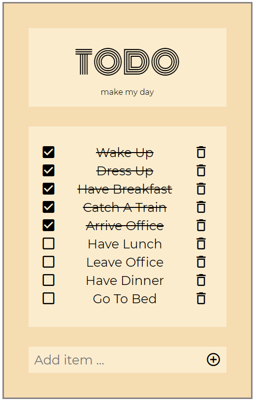

# A Simple TODO list in HTML, CSS and JS

This app is a classic hello-world type JS project for starter. But it is very much worth doing for a beginner who want to learn HTML, CSS and JS. The best part of it for me being a Python programmer is being able to figure out how CSS works. the JS part is relatively easy if you are comfortable to Python programming. I found that it is crucial as to how you should organize your element structure together with the CSS class naming convention. After googling for a while I learnt about the [BEM naming convention](https://de.wikipedia.org/wiki/Block,_Element,_Modifier), which is very much useful in keeping the DOM tree clean and easy to understand. BEM has also helped to avoid building up CSS selector in a nested structure, which is usually hard to understand and easy to catch bugs.

To run this app, clone the project and open `index.html` with a modern web browser. Below is a screen shot you would expect to see:  

